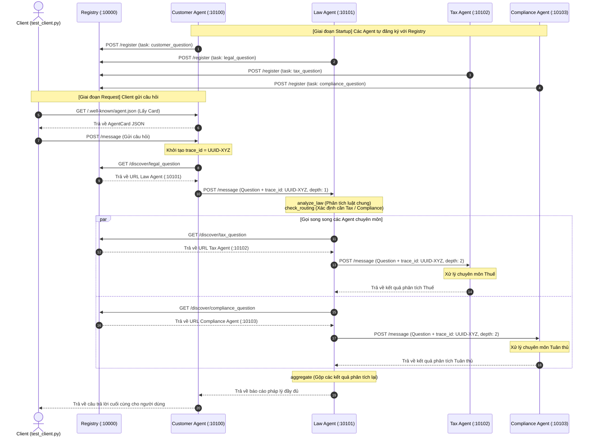
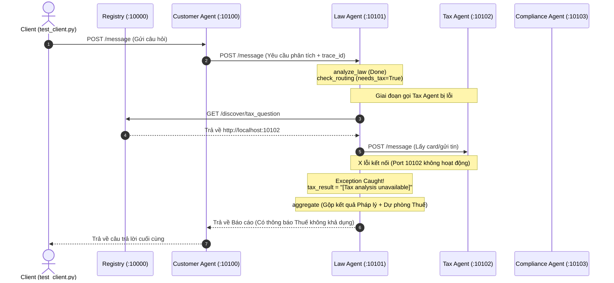

# Codelab: Xây Dựng Hệ Thống Multi-Agent với A2A Protocol

**Thời gian:** 2 giờ  
**Ngôn ngữ:** Python 3.11+  
**Công nghệ:** LangGraph, LangChain, A2A SDK

## Mục Tiêu Học Tập

Sau khi hoàn thành codelab này, bạn sẽ:
- Hiểu cách LLM hoạt động từ cơ bản đến nâng cao
- Biết cách tích hợp tools và RAG vào LLM
- Xây dựng được single agent với ReAct pattern
- Tạo multi-agent system với LangGraph
- Triển khai distributed agents với A2A protocol

## Chuẩn Bị

### Yêu Cầu Hệ Thống
- Python 3.11 trở lên
- [uv](https://docs.astral.sh/uv/) package manager
- API key từ [OpenRouter](https://openrouter.ai)

### Cài Đặt

```bash
# Clone repository
git clone <repo-url>
cd legal_multiagent

# Cài đặt dependencies
uv sync

# Cấu hình environment
cp .env.example .env
# Sửa file .env, thêm OPENROUTER_API_KEY của bạn
```

---

## Phần 1: Direct LLM Calling (20 phút)

### Lý Thuyết

LLM (Large Language Model) ở dạng cơ bản nhất là một API nhận input text và trả về output text. Không có memory, không có tools, chỉ dựa vào training data.

**Ưu điểm:**
- Đơn giản, dễ implement
- Phản hồi nhanh

**Nhược điểm:**
- Không có kiến thức real-time
- Không thể tra cứu database
- Không có context giữa các lần gọi

### Thực Hành

**Bước 1:** Chạy demo Stage 1

```bash
uv run python stages/stage_1_direct_llm/main.py
```

```
======================================================================
STAGE 1: Direct LLM Calling
======================================================================

[How it works]
  1. We send a system prompt + user question directly to the LLM
  2. The LLM responds from its training data only
  3. No tools, no retrieval, no external knowledge

Question: What are the legal consequences if a company breaches a non-disclosure agreement?
----------------------------------------------------------------------

>>> Calling LLM directly (no tools, no RAG)...

When a company breaches a non-disclosure agreement (NDA), several legal consequences may arise:

1. **Injunctions**: The non-breaching party can seek a court order to prevent further unauthorized disclosures. This is often a preliminary step to stop ongoing or imminent breaches.

2. **Monetary Damages**: The breaching party may be liable for damages. These can include:
   - **Compensatory Damages**: To cover actual losses incurred due to the breach.
   - **Consequential Damages**: For indirect losses, if they were foreseeable at the time the NDA was signed.
   - **Liquidated Damages**: If specified in the NDA, these are pre-determined amounts agreed upon in case of a breach.

3. **Specific Performance**: The court may order the breaching party to fulfill their obligations under the NDA, though this is less common in NDA cases.

4. **Reputational Damage**: Breaching an NDA can harm a company’s reputation, affecting future business relationships and opportunities.

5. **Legal Costs**: The breaching party may be responsible for the non-breaching party’s legal fees, especially if the NDA includes a clause to that effect.

6. **Termination of Contracts**: If the NDA is part of a larger contractual relationship, the breach could lead to termination of that contract.

7. **Loss of Trust**: Beyond legal consequences, a breach can lead to a loss of trust and damage to business relationships, which can have long-term impacts on business operations and partnerships.

The specific consequences depend on the terms of the NDA, the nature of the breach, and applicable laws. Parties often resolve such disputes through negotiation or mediation to avoid costly litigation.

----------------------------------------------------------------------
[Limitations of Stage 1]
  - Stateless: no conversation memory between calls
  - No tools: cannot search databases or calculate damages
  - Knowledge cutoff: only knows what was in training data
  - No grounding: cannot cite specific statutes or current case law

Next: Stage 2 adds RAG and tools to ground responses in real data.
======================================================================
```

**Bước 2:** Đọc và hiểu code

Mở file `stages/stage_1_direct_llm/main.py` và trả lời:

1. LLM được khởi tạo như thế nào? (Tìm hàm `get_llm()`) 
```python
def get_llm() -> ChatOpenAI:
    """Return a ChatOpenAI client pointed at OpenRouter."""
    return ChatOpenAI(
        model=os.getenv("OPENROUTER_MODEL", "anthropic/claude-sonnet-4-5"),
        openai_api_key=os.getenv("OPENROUTER_API_KEY"),
        openai_api_base="https://openrouter.ai/api/v1",
    )
```
2. Message được gửi đến LLM có cấu trúc gì?
[
  { "role": "system", "content": "..." },
  { "role": "user", "content": "..." }
]

3. Tại sao cần có `SystemMessage` và `HumanMessage`?

SystemMessage (Tin nhắn Hệ thống): Đóng vai trò cấu hình hành vi của AI. Nó thiết lập vai trò (persona), định dạng câu trả lời (ví dụ: độ dài, văn phong), và các luật lệ bảo mật/ràng buộc mà AI phải tuân thủ xuyên suốt cuộc hội thoại.

HumanMessage (Tin nhắn của Người dùng): Đóng vai trò là câu hỏi hoặc yêu cầu cụ thể, động từ người dùng. AI sẽ nhận thông tin này và xử lý dựa trên chỉ thị đã được thiết lập bởi SystemMessage.

**Bài Tập 1.1:** Thay đổi câu hỏi

Sửa biến `QUESTION` thành câu hỏi pháp lý khác (tiếng Việt hoặc tiếng Anh) và chạy lại.
Done
**Bài Tập 1.2:** Thêm temperature control

Thêm parameter `temperature=0.3` vào hàm `get_llm()` trong `common/llm.py` để làm output ổn định hơn.
Done
---

## Phần 2: LLM + RAG & Tools (30 phút)

### Lý Thuyết

**RAG (Retrieval-Augmented Generation):** Cho phép LLM tra cứu knowledge base trước khi trả lời.

**Tools:** Các function mà LLM có thể gọi để thực hiện tác vụ cụ thể (tính toán, query database, gọi API).

**Function Calling Flow:**
1. LLM nhận câu hỏi + danh sách tools
2. LLM quyết định gọi tool nào (hoặc không gọi)
3. Tool được execute, trả về kết quả
4. LLM nhận kết quả và tạo câu trả lời cuối cùng

### Thực Hành

**Bước 1:** Chạy demo Stage 2

```bash
uv run python stages/stage_2_rag_tools/main.py
```

```
======================================================================
STAGE 2: LLM + RAG / Tools
======================================================================

[How it works]
  1. LLM receives tools (search_legal_database, calculate_damages)
  2. LLM decides which tools to call and with what arguments
  3. We execute the tools and feed results back to the LLM
  4. LLM generates a final answer grounded in retrieved data

Question: What are the legal consequences if a company breaches a non-disclosure agreement?
----------------------------------------------------------------------

>>> Step 1: Asking LLM (with tools bound)...

>>> Step 2: LLM requested 1 tool call(s):

  Tool: search_legal_database
  Args: {'query': 'breach of non-disclosure agreement consequences'}
  Result: [nda_trade_secret] NDA breaches may trigger both contractual and statutory liability. Under the Defend Trade Secrets Act (DTSA, 18 U.S.C. § 1836), misappropriation of trade secrets can result in: (1) ...   

>>> Step 3: LLM generating final answer with tool results...


----------------------------------------------------------------------
[Improvements over Stage 1]
  + Grounded: answers cite specific statutes (DTSA, UCC, etc.)
  + Tool use: can search databases and calculate damages
  + More accurate: retrieval reduces hallucination risk

[Limitations of Stage 2]
  - Manual orchestration: we wrote the tool-call loop ourselves
  - Single pass: only one round of tool calls
  - No reasoning loop: LLM can't decide to search again if needed

Next: Stage 3 wraps this in an autonomous ReAct agent loop.
======================================================================
```
**Bước 2:** Phân tích code

Mở `stages/stage_2_rag_tools/main.py` và tìm:

1. Hàm `@tool` decorator được dùng ở đâu?
hàm decorator được dùng ở đầu mỗi function() 
2. `LEGAL_KNOWLEDGE` được cấu trúc như thế nào?
{
    "id": "",
    "keywords": [],
    "text": (),
}
3. LLM được bind với tools ra sao? (Tìm `.bind_tools()`)
Sử dụng phương thức .bind_tools(TOOLS) của đối tượng LLM để liên kết danh sách các công cụ. Nó sẽ chuyển hóa định nghĩa hàm thành định dạng JSON schema truyền kèm theo API để mô hình biết được khả năng của nó.

**Bài Tập 2.1:** Thêm knowledge base entry

Thêm một entry mới vào `LEGAL_KNOWLEDGE` về luật lao động:

```python
{
    "id": "labor_law",
    "keywords": ["lao động", "sa thải", "hợp đồng lao động", "labor", "termination"],
    "text": (
        "Theo Bộ luật Lao động Việt Nam 2019, người sử dụng lao động có thể "
        "đơn phương chấm dứt hợp đồng trong các trường hợp: (1) người lao động "
        "thường xuyên không hoàn thành công việc; (2) bị ốm đau, tai nạn đã điều trị "
        "12 tháng chưa khỏi; (3) thiên tai, hỏa hoạn; (4) người lao động đủ tuổi nghỉ hưu."
    ),
}
```

**Bài Tập 2.2:** Tạo tool mới

Tạo một tool `@tool` mới tên `check_statute_of_limitations` nhận vào `case_type` (string) và trả về thời hiệu khởi kiện:

```python
@tool
def check_statute_of_limitations(case_type: str) -> str:
    """Kiểm tra thời hiệu khởi kiện theo loại vụ án.
    
    Args:
        case_type: Loại vụ án (contract, tort, property)
    """
    limits = {
        "contract": "4 năm (UCC § 2-725)",
        "tort": "2-3 năm tùy bang",
        "property": "5 năm",
    }
    return limits.get(case_type.lower(), "Không xác định")
```

Thêm tool này vào danh sách tools và test.

---

## Phần 3: Single Agent với ReAct (25 phút)

### Lý Thuyết

**ReAct Pattern:** Reasoning + Acting

Agent tự động lặp lại chu trình:
1. **Think:** Suy nghĩ cần làm gì
2. **Act:** Gọi tool
3. **Observe:** Nhận kết quả
4. Lặp lại cho đến khi có câu trả lời cuối cùng

LangGraph cung cấp `create_react_agent` để tự động hóa pattern này.

### Thực Hành

**Bước 1:** Chạy demo Stage 3

```bash
uv run python stages/stage_3_single_agent/main.py
```

**Bước 2:** Quan sát output

Chú ý cách agent tự động:
- Quyết định tool nào cần gọi
- Gọi nhiều tools liên tiếp
- Tổng hợp kết quả

**Bước 3:** Đọc code

Mở `stages/stage_3_single_agent/main.py`:

1. Tìm `create_react_agent()` — đây là magic function
Hàm create_react_agent() là hàm dựng sẵn (prebuilt) của LangGraph. Nó tự động tạo ra một đồ thị (StateGraph) gồm 2 Node chính: agent (LLM) và tools (thực thi công cụ) cùng các Edge có điều kiện để tự động hóa hoàn toàn chu trình ReAct (suy nghĩ -> gọi công cụ -> phản hồi kết quả -> suy nghĩ tiếp).

2. So sánh với Stage 2: không còn manual tool loop
Ở Stage 2, chúng ta phải tự viết code Python bằng tay để kiểm tra xem response.tool_calls có tồn tại không, tự chạy vòng lặp for để gọi từng tool, rồi lại tự gọi LLM lần thứ hai để tổng hợp kết quả (chỉ chạy được tối đa 1 lượt duy nhất).
Ở Stage 3, toàn bộ logic kiểm tra và lặp này được đóng gói trong vòng tuần hoàn của đồ thị LangGraph. Agent có khả năng chạy lặp lại nhiều lần (multi-step reasoning) một cách tự động cho đến khi tự thấy đủ thông tin.

3. Xem `agent_executor.invoke()` — chỉ cần gọi một lần
Đúng vậy. Thay vì phải gọi LLM nhiều lần và chèn ToolMessage thủ công như Stage 2, ở Stage 3 ta chỉ cần kích hoạt đồ thị một lần duy nhất bằng graph.invoke() hoặc graph.astream(). Toàn bộ quá trình truyền nhận dữ liệu giữa LLM và các Tool được quản lý tự động thông qua messages trong State của đồ thị.

**Bài Tập 3.1:** Thêm tool tra cứu án lệ

```python
@tool
def search_case_law(keywords: str) -> str:
    """Tìm kiếm án lệ theo từ khóa.
    
    Args:
        keywords: Từ khóa tìm kiếm
    """
    cases = {
        "breach": "Hadley v. Baxendale (1854) - Consequential damages",
        "negligence": "Donoghue v. Stevenson (1932) - Duty of care",
        "contract": "Carlill v. Carbolic Smoke Ball Co (1893) - Unilateral contract",
    }
    for key, case in cases.items():
        if key in keywords.lower():
            return case
    return "Không tìm thấy án lệ phù hợp"
```

Thêm vào tools list và test với câu hỏi về breach of contract.

**Bài Tập 3.2:** Debug agent reasoning

Thêm `verbose=True` vào `create_react_agent()` để xem chi tiết quá trình suy nghĩ của agent.

ở bản mới verbose=True đã được tích hợp vào create_react_agent() rồi
---

## Phần 4: Multi-Agent In-Process (30 phút)

### Lý Thuyết

**Multi-Agent System:** Nhiều agents chuyên môn hóa cùng làm việc.

**Ưu điểm:**
- Mỗi agent tập trung vào domain riêng
- Có thể chạy song song (parallel execution)
- Dễ maintain và mở rộng

**LangGraph StateGraph:**
- Định nghĩa state (dữ liệu chia sẻ giữa các nodes)
- Tạo nodes (các bước xử lý)
- Định nghĩa edges (luồng điều khiển)

**Send API:** Cho phép dispatch nhiều tasks song song.

### Thực Hành

**Bước 1:** Chạy demo Stage 4

```bash
uv run python stages/stage_4_milti_agent/main.py
```

**Bước 2:** Phân tích kiến trúc

Mở `stages/stage_4_milti_agent/main.py`:

1. Tìm `class State(TypedDict)` — đây là shared state
Là nơi định nghĩa cấu trúc dữ liệu chung được truyền qua lại giữa các Node. Mỗi Agent sẽ cập nhật phần phân tích của mình vào đây (law_analysis, tax_analysis, compliance_analysis).

2. Tìm các agent functions: `law_agent`, `tax_agent`, `compliance_agent`
3. Tìm `Send()` API — dispatch parallel tasks
Send() API: Dùng để gửi yêu cầu (dispatch) sang một node khác một cách linh hoạt, đặc biệt dùng để chạy song song (Fan-out). Ví dụ, hàm check_routing trả về một list các Send("agent_name", state) để kích hoạt song song nhiều Agent.

4. Xem `graph.add_node()` và `graph.add_edge()`
graph.add_node() và graph.add_edge(): Dùng để định nghĩa các Node (hàm xử lý) và các Edge (luồng di chuyển tuần tự của dữ liệu) trong đồ thị.

**Bước 3:** Vẽ graph

```python
# Thêm vào cuối file main.py
from IPython.display import Image, display
display(Image(graph.get_graph().draw_mermaid_png()))
```

**Bài Tập 4.1:** Thêm agent mới

Tạo `privacy_agent` chuyên về GDPR và privacy law:

```python
def privacy_agent(state: State) -> dict:
    """Agent chuyên về luật bảo vệ dữ liệu cá nhân."""
    llm = get_llm()
    
    prompt = f"""Bạn là chuyên gia về GDPR và luật bảo vệ dữ liệu cá nhân.
    
Câu hỏi gốc: {state['question']}
Phân tích pháp lý: {state.get('law_analysis', 'N/A')}

Hãy phân tích các vấn đề về privacy và GDPR (nếu có).
"""
    
    response = llm.invoke([HumanMessage(content=prompt)])
    return {"privacy_analysis": response.content}
```

Thêm node này vào graph và kết nối với `aggregate_results`.

**Bài Tập 4.2:** Implement conditional routing

Sửa `check_routing` để chỉ gọi privacy_agent khi câu hỏi có từ khóa "data", "privacy", "gdpr":

```python
def check_routing(state: State) -> list[Send]:
    question_lower = state["question"].lower()
    tasks = []
    
    if any(kw in question_lower for kw in ["tax", "irs", "thuế"]):
        tasks.append(Send("tax_agent", state))
    
    if any(kw in question_lower for kw in ["compliance", "sec", "regulation"]):
        tasks.append(Send("compliance_agent", state))
    
    if any(kw in question_lower for kw in ["data", "privacy", "gdpr", "dữ liệu"]):
        tasks.append(Send("privacy_agent", state))
    
    return tasks if tasks else [Send("aggregate_results", state)]
```

---

## Phần 5: Distributed A2A System (15 phút)

### Lý Thuyết

**A2A (Agent-to-Agent) Protocol:** Chuẩn giao tiếp giữa các agents qua HTTP.

**Khác biệt với Stage 4:**
- Mỗi agent là một service độc lập
- Giao tiếp qua HTTP thay vì in-process
- Dynamic discovery qua Registry
- Có thể scale từng agent riêng biệt

**Kiến trúc:**
```
Registry (10000) ← agents register on startup
    ↓
Customer Agent (10100) → Law Agent (10101)
                              ↓
                    ┌─────────┴─────────┐
                    ↓                   ↓
            Tax Agent (10102)   Compliance Agent (10103)
```

### Thực Hành

**Bước 1:** Khởi động toàn bộ hệ thống

```bash
./start_all.sh
```

Chờ ~10 giây để tất cả services khởi động.

**Bước 2:** Test hệ thống

```bash
uv run python test_client.py
```

**Bước 3:** Quan sát logs

Mở 5 terminal tabs và xem logs của từng service:
- Registry: port 10000
- Customer Agent: port 10100
- Law Agent: port 10101
- Tax Agent: port 10102
- Compliance Agent: port 10103

**Bài Tập 5.1:** Trace request flow

Trong logs, tìm `trace_id` và theo dõi request đi qua các agents. Vẽ sequence diagram.

**Bài Tập 5.2:** Test dynamic discovery

1. Dừng Tax Agent (Ctrl+C)
netstat -ano | findstr :10102
taskkill //F //PID pidid
2. Chạy lại `test_client.py`
3. Quan sát lỗi và cách hệ thống xử lý
Trong code của Law Agent (law_agent/graph.py tại hàm call_tax), toàn bộ đoạn mã gọi gọi A2A được bọc trong khối try...except Exception as exc:.
Khi gặp lỗi kết nối, chương trình nhảy vào khối except, ghi nhận log lỗi cảnh báo: [law_agent] ERROR call_tax failed: All connection attempts failed.
Thay vì làm dừng (crash) toàn bộ hệ thống, Law Agent sẽ trả về một kết quả dự phòng (fallback): {"tax_result": "[Tax analysis unavailable: All connection attempts failed]"}
Đồ thị LangGraph tiếp tục chạy đến bước aggregate. Báo cáo cuối cùng vẫn được xuất ra thành công, chỉ riêng phần Phân tích Thuế (Tax) sẽ hiển thị thông báo không khả dụng ở trên thay vì bị sập hệ thống.


**Bài Tập 5.3:** Modify agent behavior

Sửa `tax_agent/graph.py`, thay đổi system prompt để agent trả lời ngắn gọn hơn. Restart tax agent và test lại.

---

## Phần 6: Tổng Kết & Mở Rộng (10 phút)

### So Sánh 5 Stages

| Stage | Pattern | Use Case | Complexity |
|---|---|---|---|
| 1 | Direct LLM | Câu hỏi đơn giản, không cần tools | ⭐ |
| 2 | LLM + Tools | Cần tra cứu data hoặc tính toán | ⭐⭐ |
| 3 | ReAct Agent | Tự động orchestration, multi-step | ⭐⭐⭐ |
| 4 | Multi-Agent | Nhiều domains, parallel processing | ⭐⭐⭐⭐ |
| 5 | Distributed A2A | Production, scalable, fault-tolerant | ⭐⭐⭐⭐⭐ |

### Câu Hỏi Ôn Tập

1. Khi nào nên dùng single agent thay vì multi-agent?
2. Ưu điểm của A2A protocol so với gRPC hoặc REST thông thường?
3. Làm thế nào để prevent infinite delegation loops trong A2A?
4. Tại sao cần Registry service? Có thể hardcode URLs không?

### Bài Tập Nâng Cao (Tự Học)

**Challenge 1:** Thêm memory/conversation history

Implement conversation memory để agent nhớ các câu hỏi trước đó.

**Challenge 2:** Add authentication

Thêm API key authentication cho các A2A endpoints.

**Challenge 3:** Implement retry logic

Khi một agent fail, tự động retry với exponential backoff.

**Challenge 4:** Monitoring & Observability

Tích hợp LangSmith hoặc Prometheus để monitor agent performance.

---

## Tài Liệu Tham Khảo

- [LangGraph Documentation](https://langchain-ai.github.io/langgraph/)
- [A2A Protocol Spec](https://github.com/google/A2A)
- [OpenRouter API](https://openrouter.ai/docs)
- Architecture diagrams: `docs/*.svg`

## Hỗ Trợ

Nếu gặp vấn đề:
1. Check `.env` file có đúng API key không
2. Đảm bảo tất cả ports (10000-10103) không bị chiếm
3. Xem logs trong terminal để debug
4. Đọc error messages cẩn thận — thường có hint rõ ràng

---

## **Bài Tập Cộng Điểm:**

1. Vite Code HTML File Để demo các tương tác của các Agent ở stage 4 hoặc stage 5
2. Sau khi chạy full Stage 5 (test_client.py) trả lời 2 câu hỏi:
- Latency (Tổng thời gian trả lời 1 câu hỏi của hệ thống) là bao nhiêu giây?
- Đề xuất phương án giảm latency và demo + show thời gian xử lý đã giảm được khi apply phương án?

**Chúc các bạn học tốt! 🚀**
